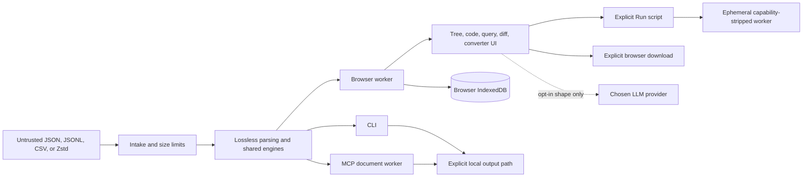

# Architecture

jsonloupe has one deterministic data engine exposed through three surfaces: a
static browser application, a local CLI, and an MCP server. There is no hosted
application backend.

## Browser application

Vite builds `index.html`, `json-to-excel.html`, and `spec.html` into a static
site. `src/main.ts` owns application coordination and DOM composition.
`src/worker.ts` owns the parsed document and performs expensive parsing,
searching, querying, diffing, compression, profiling, and conversion away from
the UI thread. Messages crossing that boundary are defined in
`src/protocol.ts`.

The UI requests bounded row slices and summaries; it does not copy the full
parsed tree into the main thread. Rendering uses `createElement` and
`textContent`, so document text is not interpreted as markup. IndexedDB access
is isolated in `src/db.ts` and stores documents only in the user's browser.

Run mode is a separate, explicit-code surface. It copies the current document
through plain `JSON.parse` into a fresh ephemeral worker, strips that worker's
network and browser-storage capabilities, executes only the script the user put
in the Run editor, and terminates on its first result or timeout. It never runs
inside the lossless document worker and is not reachable from Ask/model output.

## Shared deterministic engines

The reusable logic is deliberately DOM-free:

- `src/codec.ts`, `src/lossless.ts`, and `src/exact-number.ts` preserve the
  source spelling of values that JavaScript numbers cannot represent exactly.
- `src/query.ts`, `src/profile.ts`, and `src/semantic.ts` implement bounded
  queries, profiles, and semantic comparisons.
- `src/convert/` detects tabular structures, freezes a declarative conversion
  specification, previews real rows, validates it, and streams CSV/XLSX output.
- `src/transport.ts` measures encoded payloads against explicit transport
  budgets.

The browser, CLI, and MCP server call these same modules. A conversion mapping
therefore has the same meaning on every surface.

## CLI and MCP

`bin/jsonloupe.mjs` serves the prebuilt browser bundle on loopback only.
`bin/jsonloupe-mcp.mjs` starts the stdio MCP server. Build scripts bundle their
implementations into `dist-cli/` and `dist-mcp/`, leaving the published package
with zero runtime dependencies.

The MCP server accepts only explicit input and output paths from its client. A
document is parsed in a worker thread and referenced by an opaque document id;
tool responses are bounded while complete exports stream to a same-directory
temporary file and publish atomically.

## Network and trust boundaries

The static application has no first-party server. Its only external runtime
boundary is the opt-in Ask feature in `src/nl.ts`. That feature sends a
document shape—field names, types, and array lengths—plus the user's question
to the provider selected by the user. It does not send document values. The
returned string is parsed as jsonloupe's constrained query grammar and is never
executed as JavaScript.

The development-only API-key endpoint exists only under `npm run dev`, accepts
loopback Host and Origin values, and reads its configured key file only after
those checks. Production static builds contain no equivalent endpoint.

The complete security argument and residual risks are maintained in
[SECURITY-ASSURANCE.md](SECURITY-ASSURANCE.md).

## Build and release flow

CI runs the contract linter, the test suite with an 80% statement threshold,
TypeScript checks, production builds, and the clean-path repeatability check.
GitHub Releases trigger `.github/workflows/publish.yml`, which uses npm trusted
publishing and short-lived OIDC identity. Verification instructions are in
[RELEASING.md](RELEASING.md).
