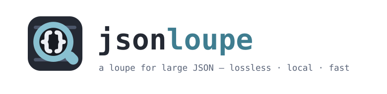
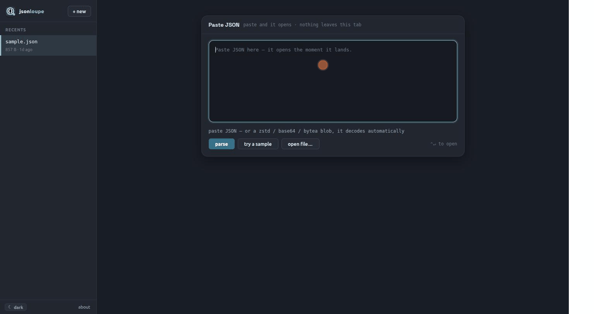

<p align="center">
  <picture>
    <source media="(prefers-color-scheme: dark)" srcset=".github/assets/banner-dark.svg">
    
  </picture>
</p>

<p align="center">
  <a href="https://github.com/priyanshuN/jsonloupe/actions/workflows/ci.yml"></a>
  <a href="https://scorecard.dev/viewer/?uri=github.com/priyanshuN/jsonloupe"></a>
  <a href="https://www.npmjs.com/package/jsonloupe"></a>
  <a href="https://www.bestpractices.dev/projects/13920"></a>
  <a href="LICENSE"></a>
  <a href="tsconfig.json"></a>
  <a href="SECURITY.md"></a>
  <a href="#why-another-json-viewer"></a>
</p>

<p align="center">
  <a href="https://raw.githubusercontent.com/priyanshuN/jsonloupe/main/.github/assets/demo.gif">
    
  </a>
</p>

jsonloupe is a browser-based workbench for inspecting, diffing, editing, and
querying JSON documents that are too big or too precise for ordinary viewers —
and for turning them into spreadsheets: nested JSON goes in, linked tables come
out, as one `.xlsx` or a zip of CSVs. Everything runs in your browser: documents
are parsed in a web worker, stored in IndexedDB, and never uploaded anywhere. No
backend, no account, no telemetry.

## Run it

Use the hosted app at **[jsonloupe.dev](https://jsonloupe.dev)** — or run the identical bundle from your own machine, fully offline:

```bash
npx jsonloupe
```

That starts a loopback-only static server (`127.0.0.1:5199`) serving the prebuilt
app from the package — no runtime dependencies, no network calls, ~60 lines of
auditable server in [bin/jsonloupe.mjs](bin/jsonloupe.mjs). `--port <n>` and
`--no-open` do what they say.

## Why another JSON viewer?

- **Lossless numbers.** Int64 IDs beyond 2^53 (snowflake/order/entity IDs) and
  precise decimals survive paste → view → edit → copy → download with their exact
  digits. Nothing is ever coerced to a float.
- **Built for huge documents.** The tree is virtualized and expansion is chunked
  (`[0 … 9999]` range rows), so opening a five-million-element array is instant.
  Parsing, diffing, search, and compression all run off the UI thread.
- **Compressed payloads are first-class.** Paste or drop raw `.zst`, Base64-Zstd
  (standard or URL-safe), or PostgreSQL `\x…` bytea — it's detected, decoded in
  the worker, and opened as a document with a transformation trace. An encoder
  and a transport-size inspector (exact UTF-8 / Zstd / Base64 / envelope bytes
  against editable budgets) round-trip the other way.
- **Nested JSON becomes a spreadsheet, on your machine.** Repeating arrays and
  object maps become their own linked tables — `orders` and `order_items` joined
  by `order_id`, never `items/0/sku` columns. You see real rows before anything
  is written, and the mapping saves as a small file that produces the same
  columns from next month's file, with no model involved.
- **Semantic diff.** Side-by-side compare with identity-based array alignment
  (match by `id`, composite keys, or auto-detected), so reordered arrays don't
  drown you in false changes. Ignore noisy fields by key or path prefix.
- **A real query language.** A JSONPath subset with predicates and aggregation
  pipes (`$.tasks[?(@.status == 'FAILED')] | group(@.failureReason)`), executed
  locally with live preview as you type. Numeric literals, predicates, sums,
  averages, minima, and maxima remain exact for int64 and precise decimals.

## Quick start

```sh
npm install
npm run dev        # http://localhost:5199
```

Paste JSON on the landing page — it parses instantly and is saved to local
memory (Recents sidebar: reopen, pin, delete). Malformed input (trailing commas,
single quotes, Python literals, truncated log extracts) is auto-repaired and
flagged, with the original bytes preserved.

## Feature tour

- **Tree / Code / Split views** — virtualized tree, editable CodeMirror code
  view (fold, search, apply-with-`⌘S`), or both side by side with click-to-line
  sync. Inline-edit primitives in the tree; full undo/redo across edits.
- **Search & filter** — `/` to search (literal or `/regex/i`), filter mode
  prunes the tree to matching branches and restores your expansion state after.
- **Path & identity** — breadcrumb with one-click copy as JSONPath, JSON
  Pointer, or JS accessor; "same value" jumps to every node holding a value
  (schema-free correlation-ID tracing).
- **Value lenses** — epoch → local date, lat/lng, uuid/url/base64 flags, byte
  weight on collapsed containers so the heavy node is findable at a glance.
- **Tables & CSV** — any array gets a sortable table view; export exact-digit
  CSV (RFC 4180) of tables or query results.
- **Run — a library of your own functions** — write JavaScript for the questions
  no query language should have to answer, keep it under a name, and press it
  over tomorrow's file. Scripts run in an ephemeral sandbox worker with `fetch`,
  storage and the network removed, and the result opens as a document of its
  own. Tick several and one press answers all of them as a single report.
  ([below](#playbooks-your-functions-as-a-file).)
- **JSON → Excel / CSV converter** — rename and reorder columns, choose source
  fields, add constants, set date and coordinate handling, take the column names
  from a target CSV header, and save or share the mapping for the next file.
  ([below](#nested-json-to-linked-tables).)
- **File handles** — drop `.json`/`.jsonl`/`.zst` files; reload re-reads from
  disk and shows what changed since the version you were looking at.
- **Ask (optional, off by default)** — type an English question and it's
  translated to a query by an LLM using **only the document's shape (field
  names/types — never values)**, then executed locally. Bring your own
  Anthropic or OpenRouter key; with no key configured the feature is inert and
  the page makes zero network requests. A disclosure panel shows exactly what
  would be sent. See [SECURITY.md](SECURITY.md).

## Nested JSON to linked tables

If a spreadsheet is the only thing you came for,
[jsonloupe.dev/json-to-excel.html](https://jsonloupe.dev/json-to-excel.html) is
that job on a page of its own: paste, convert, done.

Open a document and choose **convert**. Every repeating array becomes its own
table, joined back to its parent by the id that was already in the data — so
this:

```json
{ "orders": [
    { "id": 7, "cust": "ACME",
      "items": [ { "sku": "A", "qty": 2 }, { "sku": "B", "qty": 1 } ] } ] }
```

comes out as two sheets rather than one row full of `items/0/sku` columns:

```
orders                    order_items
id  cust                  order_id  sku  qty
 7  ACME                         7  A      2
                                 7  B      1
```

jsonloupe finds those tables for you but never runs the guess blindly: the
mapping and a preview of real rows stay on screen while you rename columns,
choose which fields to keep, and say how dates and coordinates should be read.
What you approve is saved as a small mapping file — keep it in this browser,
export it, or use it from the command line:

```bash
jsonloupe inspect payload.json          # what tables are in here?
jsonloupe draft   payload.json -o payload.spec.json   # a first mapping, to read
jsonloupe convert payload.json --spec payload.spec.json -o payload.xlsx
```

The same mapping produces the same columns through the browser, the CLI, and the
MCP server, with no model in the loop — that is the point of freezing it. What
lands in the cells is what was in the document: dates arrive as real dates you
can sort and subtract, numbers and coordinates as numbers, and text that only
looks numeric stays text, so `"1.10"` keeps its trailing zero and an int64 id
keeps every digit instead of being rounded. Excel's limits and values a column
cannot read are reported or refused, never quietly written wrong.

## Playbooks: your functions as a file

The document changes daily; the handful of questions you ask of it does not. So
**run** opens on your library rather than an empty editor — named functions,
newest first — and pressing one runs it over whatever is open. Tick several and
one press answers all of them, as a single object keyed by function name: today's
report, which downloads and reopens as a document like any other.

A function learns what it reads. The first time one runs it is handed the
document through a recording proxy, and the paths it actually touched are kept
with it. That is what lets the panel say

> this reads `orders`, `orders[].deliveredInHours` — this document has none of that

*before* you press run, instead of leaving you to read an empty result as "none
today". It is always a remark and never a gate: the reading knows only the branch
that last run took, so the run button still works.

A playbook is that library as a file — the questions, never the data:

```json
{
  "playbookVersion": 1,
  "name": "carrier dumps",
  "functions": [
    {
      "name": "slow orders",
      "script": "data.orders.filter(o => o.deliveredInHours > 48)",
      "reads": ["orders", "orders[].deliveredInHours"]
    }
  ]
}
```

Export writes one; dropping one on the window installs it. Import **merges and
never replaces** — a name you already use keeps yours and the incoming one lands
as `slow orders 2`, because a duplicate is one `×` away and an overwrite is not.
Unknown fields are refused by name rather than dropped, so a file from a newer
jsonloupe cannot import as a subset of itself and look like it worked.

Scripts run in an ephemeral worker with `fetch`, `XMLHttpRequest`, WebSockets,
IndexedDB and `importScripts` removed before any user code, terminated on its
result or after ten seconds — a pasted script cannot reach the network or the
documents you have opened. They see plain `JSON.parse` values, so an int64 id
arrives rounded there; the panel says so out loud rather than hiding it, and the
lossless path is everywhere else in the app.

## Use with AI agents

The same engine runs as an [MCP](https://modelcontextprotocol.io) server, so an
agent can work on a document that would never fit in its context:

```bash
claude mcp add jsonloupe -- npx -y -p jsonloupe jsonloupe-mcp
```

**If you have jq and plain JSON, use jq.** This is for the cases jq is awkward
about: compressed payloads (`.zst`, Base64-Zstd, PostgreSQL `\x…` bytea) that
have to be decoded first, int64 and decimal digits that must survive the whole
pipeline exactly, identity-keyed semantic diff between two documents, and MCP
hosts that have no shell to run jq in.

Eleven tools: `load_doc`, `get_schema`, `run_query`, `profile`, `sample`,
`diff_docs`, `export_csv`, `export_result`, plus `inspect`, `draft_spec`, and
`convert` for the spreadsheet path above. For one question, pass `filePath`
straight to a tool; it opens the document and returns a reusable `docId` in the
same call. For a sequence of questions, call `load_doc` once and reuse that
`docId`. Query details default to 10 rows (use `limit=0` for summary only, or
`offset` + `limit` to page), and text and structured MCP results are both
bounded. A typical run over a 37 MB routing payload:

```
run_query filePath=payload.json "$.tasks[?(@.status == 'FAILED')] | count"
                                  → docId: d1 · count: 17500
profile d1 "$.tasks[*]"          → auto-discovered field coverage, null/missing/types,
                                    exact sums/stats, lengths, distincts and top values
run_query d1 "$.tasks[?(@.status == 'FAILED')] | group(@.region, @.failureReason)"
                                  → composite breakdown, exact complete counts
run_query d1 "$.tasks[*] | top(@.delayMinutes, @.id, @.status)" limit=5
                                  → only the five highest rows; the full array never enters context
sample d1 "$.tasks[0]"           → the whole element, id 9007199254740993 intact
export_result d1 "…| pluck(@.id, @.failureReason)" format=csv out=failed.csv
                                  → complete, atomic, rows + UTF-8 bytes only
inspect d1                       → candidate tables, fields, types, deterministic suggestions
draft_spec d1 outPath=tasks.spec.json
                                  → reviewable mapping on disk
convert d1 specPath=tasks.spec.json outPath=tasks.xlsx
                                  → workbook path + row/skipped/warning counts, never its rows
```

The common schema → profile → query loop is deliberately cheaper than loading
JSON or writing a one-off Python script: counts and aggregates stream over every
match without materializing the result list; `present`, `missing`, and `isNull`
keep false/null/absent distinct; composite grouping and bounded `top`/`bottom`
replace local sort scripts; and profiles inspect multiple or automatically
discovered fields in one scan. Complete CSV/JSONL exports stream to a temporary
file and publish atomically. Existing paths are refused unless the agent passes
`overwrite=true` explicitly.

The server makes no network calls and accesses only explicitly supplied
input/output paths. A bad query returns the grammar and a suggestion rather than
an empty result. The reproducible [agent-choice evaluation](docs/agent-choice-eval.md)
measures whether an agent selects these operations when Python is also available.

If an agent knows the MCP is installed but still writes one-off scripts, put
this routing rule in its project instructions (for example `AGENTS.md` or
`CLAUDE.md`):

> For small plain JSON, use jq when it is already the shortest safe option.
> Otherwise prefer the JsonLoupe MCP over ad-hoc Python whenever it supports the
> operation; use custom shell code only when JsonLoupe cannot answer it.

## Privacy & security

Documents never leave your machine. The complete network-call inventory (three
`fetch` calls, all in the opt-in Ask feature), the shape-only LLM contract, and
the XSS posture are documented in [SECURITY.md](SECURITY.md). The corresponding
threat model, trust boundaries, and assurance argument are in
[SECURITY-ASSURANCE.md](SECURITY-ASSURANCE.md).

## Deploying

jsonloupe builds to a fully static site:

```sh
npm run build      # dist/
```

Serve `dist/` from any static host (GitHub Pages, Cloudflare Pages, Netlify…).
There is nothing to configure server-side; the dev-only `/__api-key` convenience
endpoint simply doesn't exist in production, and Ask activates only when a
visitor adds their own key.

## Development

```sh
npm test           # vitest — query engine, worker, MCP dispatch, NL translation suites
npm run lint:security  # FLOSS security analysis + checked TypeScript style
npm run coverage   # same suite with enforced 90% statement / 80% branch floors
npm run build      # tsc --noEmit + vite build + the MCP bundle
npm run check:site-headers # verify the live OpenSSF hardening headers
npm run check:reproducible-build  # clean locked installs must produce identical bytes
npm run smoke:mcp  # drives the built MCP server over real stdio against a 37 MB fixture
npm run eval:agent -- --help  # black-box MCP-vs-Python agent-choice benchmark
```

Start with [CONTRIBUTING.md](CONTRIBUTING.md). Architecture and internals are
documented in [ARCHITECTURE.md](ARCHITECTURE.md) and [SPEC.md](SPEC.md); the
converter has its own [SPEC-converter.md](SPEC-converter.md), including what it
deliberately refuses to do. Project decisions and the next twelve months are in
[GOVERNANCE.md](GOVERNANCE.md) and [ROADMAP.md](ROADMAP.md). Official publishing
and consumer verification are documented in [RELEASING.md](RELEASING.md).

## License

[MIT](LICENSE). Bundled third-party packages are listed in
[THIRD_PARTY_LICENSES.md](THIRD_PARTY_LICENSES.md).

Software is provided "as is", without warranty of any kind — see the license
text. If you enable the Ask feature, your use of the configured LLM provider is
governed by that provider's terms.
